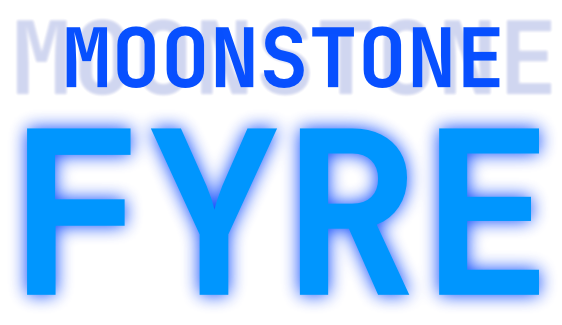

  <h1>
    <picture>
      
    </picture>
  </h1>

  <h1>
    <picture>
      
    </picture>
  </h1>
  

    I'm a 16 year old student in the Science, Technology, Engineering, and Mathematics (STEM) curriculum residing in the hellhole known as the country of the Philippines (unfortunately 🥀🥀🥀).
  

  

    I have started programming at the peak of the COVID-19 pandemic in the year 2020 when the whole world goes to a full lockdown because of it.
    The first ever language I have programmed in was in Scratch in an account before this account was made.
     
    If you are willing to look for my projects in it, then...
  

  

    Too bad! I forgot the account password of it.
    <b>BUT!</b>
    Some of them were published in GameJolt!
     
    <a href="https://gamejolt.com/@BlazingKuda/games" title="My old GameJolt account (I lost the password for it too)">
      Check it here!
    </a>
  

